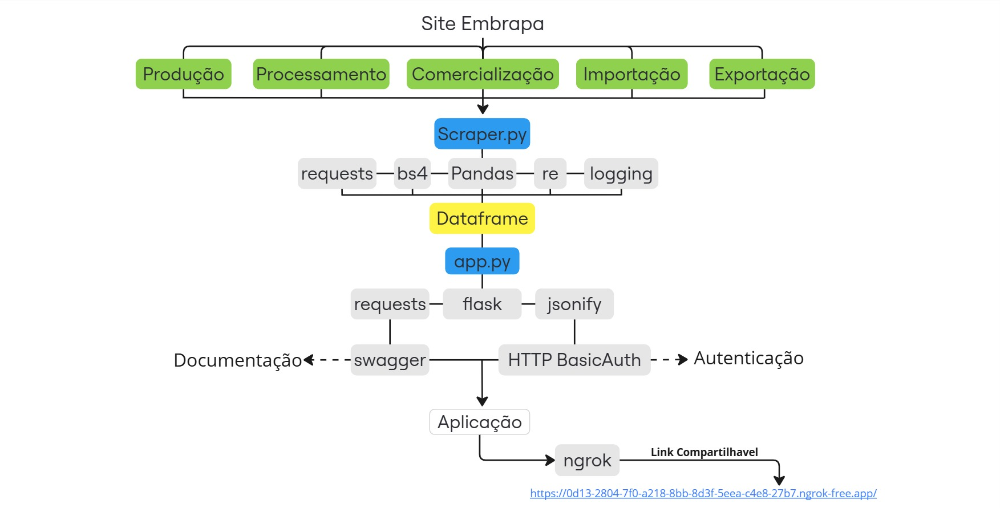

# API de Dados Vitivinicultura - Embrapa 🍇

## 🎯Objetivo do Projeto
Este projeto é corresponde ao Tech Challenge da Pos Tech em Machine Learning Engineer da FIAP. Ele consiste em desenvolver uma API para acessar e processar dados de vitivinicultura do site da Embrapa, facilitando a extração de algumas informações de categorias como a produção, processamento, comercialização, importação e exportação de produtos vitivinícolas no Brasil. 

Algumas categorias possuem subcategorias próprias, como por exemplo em processamento, conseguimos ver a quantidade dos tipos de uvas produzidas, que são viníferas, americas e híbridas, uvas de mesa e até mesmo sem classificação. Com os dados obtidos via API, é possível realizar a análise exploratória de dados com geração de insigths e até mesmo modelos de ML.

## ➡️Plano de Deploy
Utilizamos o Ngrok para fazer o deploy e disponibilizar a Aplicação na web. 
Podera acessa-la através deste link: https://0d13-2804-7f0-a218-8bb-8d3f-5eea-c4e8-27b7.ngrok-free.app/

## 💻Tecnologias Usadas
- **Python**: Linguagem principal do projeto
- **Flask**: Framework web para construção da API
- **Requests**: Biblioteca para requisições HTTP
- **BeautifulSoup**: Biblioteca para web scraping
- **Swagger**: Ferramenta para fazer a documentação de API
- **Ngrok**: Ferramenta que permite criar um "túnel" seguro para compartilhar nossa API na internet. 

## ⚙️Estrutura do Código

- **VitiviniculturaScraper**: Classe principal para a extração de dados. Define URLs para categorias específicas (produção, processamento, comercialização, importação e exportação) e contém métodos para raspagem e parseamento dos dados.
  - `scrape_data`: Extrai dados de acordo com o ano e a categoria/subcategoria selecionada.
  - `parse_html`: Converte dados HTML para formato estruturado.
- **Rotas da API**:
  - `/apidocs/`: rota para acessar a documentção funcional da API.
  - `/api/<category>`: Rota principal para acesso a dados de categorias específicas.
  - `/`: Página inicial com formulário para inserir o token de acesso.
  - `/submit_token`: Verificação do token de acesso e exibição do menu de navegação das rotas da API.
  - `/api/producao`: Dados de 'Produção'.
  - `/api/processamento?subcategory=viniferas`: Dados de 'Processamento' da categoria: Viníferas.
  - `/api/processamento?subcategory=americanas_hibridas`: Dados de 'Processamento' da categoria: Americanas e Híbridas.
  - `/api/processamento?subcategory=uvas_de_mesa`: Dados de 'Processamento' da categoria: Uvas de Mesa.
  - `/api/processamento?subcategory=sem_classificacao`: Dados de 'Processamento' da categoria: Sem Classificação.
  - `/api/comercializacao`: Dados de 'Comercialização'.
  - `/api/importacao?subcategory=vinhos_de_mesa`: Vinhos de Mesa (Importação).
  - `/api/importacao?subcategory=espumantes`: Espumantes (Importação).
  - `/api/importacao?subcategory=uvas_frescas`: Uvas Frescas (Importação).
  - `/api/importacao?subcategory=uvas_passas`: Uvas Passas (Importação).
  - `/api/importacao?subcategory=suco_de_uva`: Suco de Uva (Importação).
  - `/api/exportacao?subcategory=vinhos_de_mesa`: Vinhos de Mesa (Exportação).
  - `/api/exportacao?subcategory=espumantes`: Espumantes (Exportação).
  - `/api/exportacao?subcategory=uvas_frescas`: Uvas Frescas (Exportação).
  - `/api/exportacao?subcategory=suco_de_uva`: Suco de Uva (Exportação).
 
    

## 📝Instruções de Uso da API
1. **Clonar o Repositório**:
   ```bash
   git clone <URL_DO_REPOSITORIO>
   cd <NOME_DO_REPOSITORIO>

2. **Instalar Dependências**:
   ```bash
   pip install -r requirements.txt
   ```

3. **Executar a API**:
   ```bash
   python app.py
   ```

4. **Acessar Rotas da API**:
   - Navegue até [http://localhost:5000](http://localhost:5000) para a página inicial.
   - E/ou acesse ao link publico: https://0d13-2804-7f0-a218-8bb-8d3f-5eea-c4e8-27b7.ngrok-free.app/
   - Para ter acesso a API será necessário passar por um login. 
        Usuário: usuarioteste
        Senha: 1234

5. **Use o Ngrok para criar um túnel e compartilhar a API**:
   - ngrok http 5000 

## Diagrama da aplicação



  
  **Menu da API de Dados Vitivinícolas**
  
  Escolha uma categoria e subcategoria para acessar os dados:
  
  1. **Dados de Produção**
     ```
     GET /api/producao
     ```
  
  2. **Dados de Processamento**
     - **Viníferas**
       ```
       GET /api/processamento?subcategory=viniferas
       ```
     - **Americanas e Híbridas**
       ```
       GET /api/processamento?subcategory=americanas_hibridas
       ```
     - **Uvas de Mesa**
       ```
       GET /api/processamento?subcategory=uvas_de_mesa
       ```
     - **Sem Classificação**
       ```
       GET /api/processamento?subcategory=sem_classificacao
       ```
  
  3. **Dados de Comercialização**
     ```
     GET /api/comercializacao
     ```
  
  4. **Dados de Importação**
     - **Vinhos de Mesa**
       ```
       GET /api/importacao?subcategory=vinhos_de_mesa
       ```
     - **Espumantes**
       ```
       GET /api/importacao?subcategory=espumantes
       ```
     - **Uvas Frescas**
       ```
       GET /api/importacao?subcategory=uvas_frescas
       ```
     - **Uvas Passas**
       ```
       GET /api/importacao?subcategory=uvas_passas
       ```
     - **Suco de Uva**
       ```
       GET /api/importacao?subcategory=suco_de_uva
       ```
  
  5. **Dados de Exportação**
     - **Vinhos de Mesa**
       ```
       GET /api/exportacao?subcategory=vinhos_de_mesa
       ```
     - **Espumantes**
       ```
       GET /api/exportacao?subcategory=espumantes
       ```
     - **Uvas Frescas**
       ```
       GET /api/exportacao?subcategory=uvas_frescas
       ```
     - **Suco de Uva**
       ```
       GET /api/exportacao?subcategory=suco_de_uva
       ```
  
  **Filtrando os Dados**
  
  Para cada rota, você pode adicionar os parâmetros `start_year` e `end_year` para filtrar os dados. A resposta obtida será no formato `JSON`. 
  
  **Exemplo de chamada de API:**
  ```http
  GET http://localhost:5000/api/importacao?subcategory=espumantes&start_year=2010&end_year=2020
  ```


## 🔗Links Importantes
- [Documentação da API](https://flask.palletsprojects.com/)
- [Vídeo Explicativo do Youtube](https://requests.readthedocs.io/)
- [Site da Embrapa](https://www.crummy.com/software/BeautifulSoup/)

## 👥 Membros do Grupo
- Gabriel Tenorio Bittencourt
- Francisco Marcellus Carmo do Nascimento
- Guilherme Savaio Marquerie Rodriguez
- Guilherme Sarter
